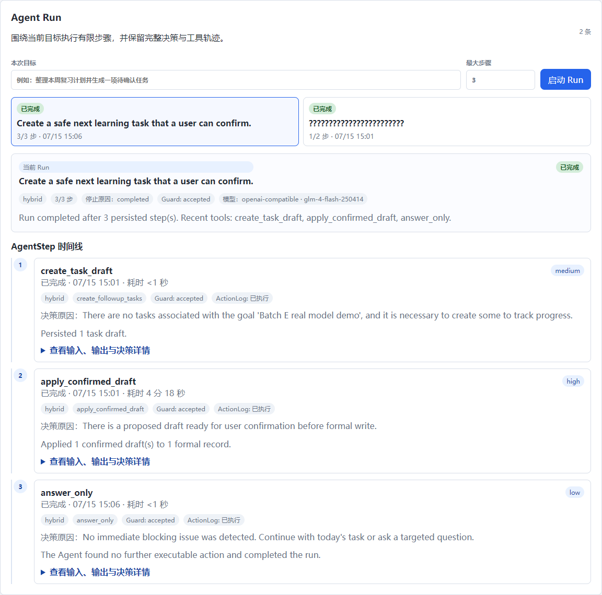
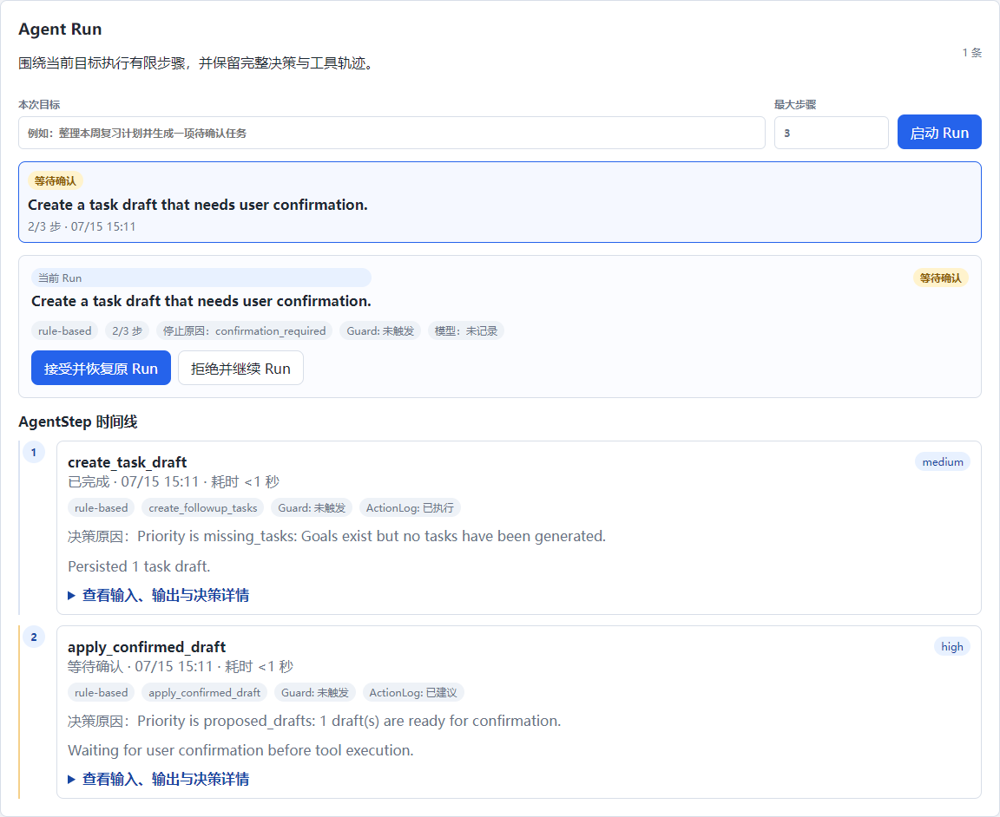
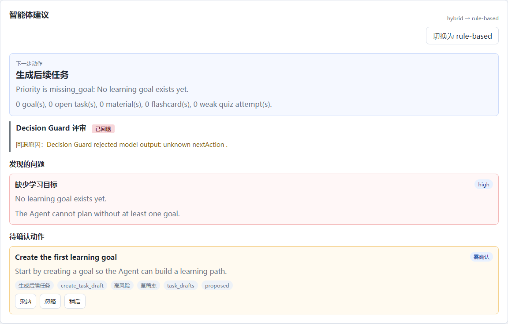
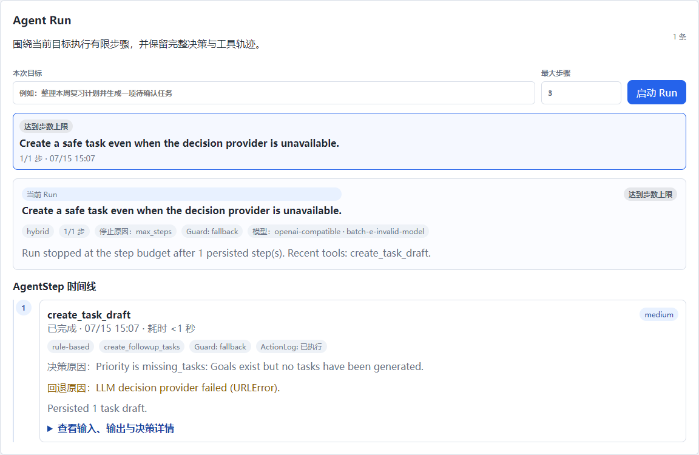
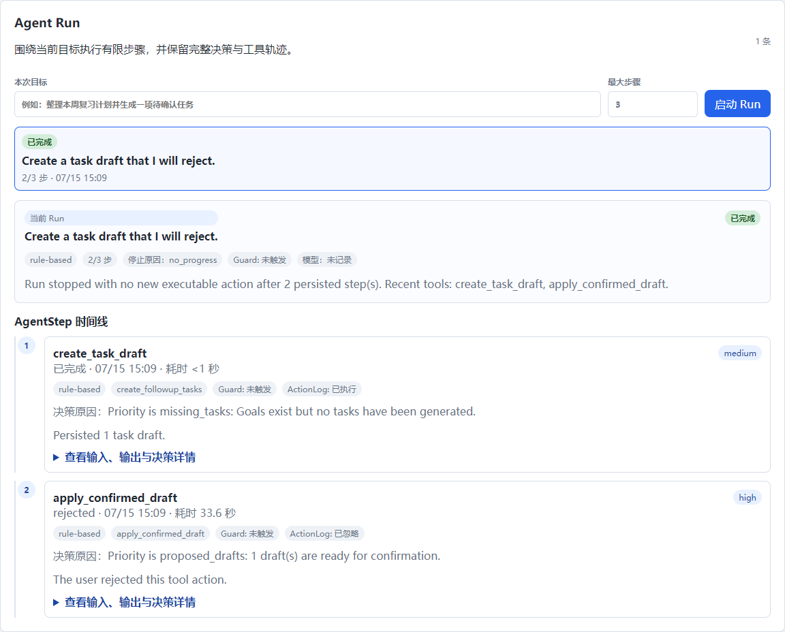

# AI-Agent

实习期间个人主导的 AI 学习智能体项目。项目从通用成长学习助手原型演进而来，当前目标是沉淀为可作为简历和作品集展示的完整学习 Agent。

## 当前定位

```text
AI-Agent：面向个人学习规划的可控学习智能体
```

项目核心目标：

```text
把目标、资料、任务、问答、测试、复习和进度反馈串成完整学习闭环，让 Agent 能根据当前学习状态判断下一步动作，并在用户确认后写入任务或复习内容。
```

## 第七版本地演示

当前本地演示使用同源 FastAPI 前端和数据库会话：浏览器只持有 `HttpOnly`、`SameSite=Lax` 的 `ai_agent_session` Cookie，服务端仅保存令牌 SHA-256 哈希。登录、注册和“一键试用”均建立独立会话；访客演示会在事务中生成隔离的目标、任务、已处理资料、闪卡、测试题和等待确认的 Agent Run，不调用真实模型。

登录页提供“一键试用”。计划部署到 Render 免费 Web 服务时，服务闲置 15 分钟后可能休眠，首次访问可能需要约 1 分钟唤醒；当前仓库尚未声明一个已经通过 Neon/Render 验收的公开 URL。

当前主线：

```text
第三版已经完成资料学习智能体最小闭环。
第四版已经补齐 AgentContext、AgentDecision、AgentActionLog、草稿态执行和上下文回读验收。
第五版已完成可控学习 Agent 升级：AgentRun、Tool Registry、LLM JSON Decision hybrid、反馈记忆增强和 Decision Guard 输出评审。
第六版已完成 Batch B6：确认写入后无条件重建并持久化 Context / Decision；即使确认步骤耗尽预算，也会先完成 readback，再以最新快照进入 max_steps。
第六版已完成 Batch C：Runtime 默认优先 hybrid；真实 Embedding、严格 JSON/范围 Guard、上下文裁剪、一次格式修复、终态 Reflection 与真实模型验收记录均已收口。
第六版已完成 Batch D：20 个固定 Runtime 场景全部通过，指标报告覆盖恢复、Guard、重复写入、失败与超限；真实 embedding-3 的 Recall@3/MRR 均优于关键词基线。
第六版已完成 Batch E：前端 Agent Run 控制台可按时间线展示每一步的决策、Guard、工具输入输出、确认状态、错误和停止原因；同时保留真实模型成功、确认恢复、Guard 拦截和失败回退的浏览器证据。
第六版已完成 Batch F：Run 支持取消与 SQLite 条件更新互斥；读工具 timeout 最多重试一次，写工具不盲目重试；持久化诊断脱敏，依赖/CI/单命令启动、录屏和最终契约文档均已收口。
```

## 当前能力

- 创建成长目标
- 添加学习或成长资料
- 自动整理资料摘要和知识点
- 将资料切分为可检索片段 chunks
- 支持 embedding + cosine similarity 语义检索资料片段，并保留关键词 fallback
- 自动生成 7 天行动计划
- 生成闪卡和简单测试题
- 支持成长问答，并通过 `POST /api/agent/ask` 返回答案、依据、学习建议和来源片段
- 支持按资料保存和读回历史问答
- 支持从资料历史问答生成复盘草稿：闪卡草稿或复习点
- 支持用户确认后把复盘草稿加入正式闪卡，并保存已掌握 / 还要复习状态
- 支持智能体工作台读取 AgentContext，并基于当前状态生成结构化 AgentDecision
- 支持 AgentActionLog 记录用户对建议的采纳、忽略、稍后和已执行状态
- 支持 AgentRun 接收 objective，并持久化多步 context、decision、action、tool input/output 与停止原因
- 支持 `观察 -> 决策 -> 工具执行 -> observation 回灌 -> 再决策` 的多步 Agent Loop
- 支持 Runtime 调用 `search_materials` 返回受 goal/material 范围约束的语义 references
- 支持 Runtime 调用 `answer_with_sources` 生成 grounded answer 并持久化 QA 记录
- 支持高风险工具暂停等待确认，并在用户接受后从原 Run 恢复执行
- 支持 completed、waiting_confirmation、failed、max_steps 和 no_progress 停止边界
- 支持 Tool Registry 为 Agent 动作补充工具名、风险等级、草稿态和执行目标
- 支持 LLM JSON Decision hybrid：真实模型结构化决策失败时回退 rule-based
- 支持 Decision Guard 评审模型输出：非法 actionType 回退 rule-based，高风险动作漏标确认时强制修正为用户确认
- 支持草稿态执行：任务建议进入任务草稿，复习建议进入复盘草稿，补资料建议预填资料表单
- 支持确认写入后的上下文回读验收，下一轮 AgentDecision 能基于新状态继续判断
- 支持前端 AgentStep 时间线：展示步骤状态、创建时间、历时、Decision、Guard、工具风险、ActionLog、错误和停止原因
- 支持默认折叠的 Tool Input / Output / Context JSON 详情，并对 API Key、Authorization、Token、Password、Secret 等字段脱敏
- 支持在工作台启动带 objective 的 Run，查看历史 Run，并在确认步骤接受并恢复原 Run 或拒绝并继续 Run
- 支持 `cancelled` Run 状态和 `POST /api/agent/runs/{run_id}/cancel`；同一 Run 通过 SQLite 条件更新只允许一个 executor 推进
- 支持读工具 deadline 后最多一次重试；写工具不盲目重试，依赖既有事务、幂等键和 `appliedEntityIds` 恢复
- 支持后端持久化日志脱敏，AgentRun/AgentStep/ActionLog 不保存 API Key、Authorization、Token、Password 或 Secret 明文
- 支持任务打卡和进度查看
- 支持基础登录注册和用户数据隔离
- 目标、任务、打卡、资料、摘要、闪卡、测试题、资料片段、资料问答记录已接入后端 SQLite 持久化

当前已完成的 AI 学习链路：

```text
添加资料 -> 生成 chunks -> 搜索资料片段 -> 围绕资料问 AI -> 展示 answer / basis / suggestion / references -> 保存并读回历史问答 -> 从问答生成复盘草稿 -> 加入正式闪卡 -> 复习打分保存
```

## 界面截图

### Agent Run 可观察化与浏览器证据

真实模型成功：浏览器中可见 `openai-compatible · glm-4-flash-250414`、3 个持久化 Step、确认后正式写入和最终 completed 状态。



确认恢复：高风险 `apply_confirmed_draft` 会停在 waiting_confirmation；点击“接受并恢复原 Run”后从同一 Run 继续。



Guard 拦截：Hybrid 模式下，模型输出会先经过 Decision Guard 校验；未知 action 会回退到 rule-based 决策，并显示原因。



失败降级：当本地 Provider 不可达时，Hybrid Run 保留 `fallbackReason`，Guard 标记为 fallback，并使用规则决策安全完成当前受控步骤。该截图是故障注入证据，不把回退结果表述为真实模型成功。



拒绝确认：拒绝高风险写入会保留 rejected Step 和 ActionLog，不会写入正式数据；Run 继续到安全终态。



### Batch F 稳定端到端录屏

单命令服务前端与 API、确认恢复和 AgentStep 时间线的本地录屏：

[观看 Batch F 端到端录屏](docs/videos/batch-f-end-to-end.webm)

当前限制：

```text
1. 当前已经具备多步 Agent Runtime，但真实领域工具和真实模型循环评测仍在完善，不宣称生产级自主智能体。
2. 高风险执行仍采用草稿态，用户确认后才写入正式任务或闪卡。
3. Runtime 生成的复盘/任务草稿已持久化到后端 agent_drafts；正式任务或闪卡仍必须确认后写入。
4. 当前只保存 new / known / review 状态，不做完整间隔重复日程。
5. 资料不足判断已有真实模型验收样例，后续更换模型时需要复跑评估样例。
```

## 环境要求

建议环境：

```text
Python 3.12+
PowerShell 或其他终端
浏览器
```

确认 Python 可用：

```bash
python --version
```

## 安装依赖

在项目根目录执行：

```bash
pip install -r backend/requirements.txt
```

如果 Windows 提示 `pip.exe` 被应用程序控制策略阻止，可以改用：

```bash
python -m pip install -r backend/requirements.txt
```

## 一条命令启动项目

在项目根目录执行：

```bash
python -m uvicorn backend.app.main:app --host 127.0.0.1 --port 8001
```

该命令同时服务前端静态资源和 API；启动成功后可以访问：

```text
前端与后端：http://127.0.0.1:8001/
接口文档：http://127.0.0.1:8001/docs
健康检查：http://127.0.0.1:8001/api/health
```

前端固定请求同源 `/api`，无需也不应在 `app/api.js` 中写入生产环境 `localhost` 地址。若本地改用其他端口，请通过 `CORS_ORIGINS` 将该完整本地 Origin 加入白名单，再从同一 Uvicorn 服务访问页面。

本地开发可额外添加 `--reload`：

```bash
python -m uvicorn backend.app.main:app --reload --host 127.0.0.1 --port 8001
```

## 可选：配置真实模型 Provider

默认不配置任何密钥时，系统使用 `MockLLMProvider`，本地测试和 smoke 不受影响。

如果要联调兼容 OpenAI Chat Completions 形状的模型服务，可以复制本地配置文件：

```powershell
Copy-Item backend/.env.example backend/.env
```

然后编辑 `backend/.env`：

```env
LLM_PROVIDER=openai-compatible
LLM_API_KEY=你的密钥
LLM_MODEL=glm-4-flash-250414
LLM_BASE_URL=https://open.bigmodel.cn/api/paas/v4
LLM_TIMEOUT_SECONDS=30
```

`backend/.env` 已加入 `.gitignore`，不要提交真实 API Key。

也可以临时用 PowerShell 环境变量启动，环境变量会优先于 `.env`：

```powershell
$env:LLM_PROVIDER="openai-compatible"
$env:LLM_API_KEY="你的密钥"
$env:LLM_MODEL="你的模型名称"
$env:LLM_BASE_URL="https://api.openai.com/v1"
$env:LLM_TIMEOUT_SECONDS="20"
python -m uvicorn backend.app.main:app --reload
```

说明：

```text
1. LLM_API_KEY 或 LLM_MODEL 缺失时会自动回退 mock。
2. 模型调用失败、超时或返回格式不可解析时会自动回退 mock。
3. 兼容服务需要提供 /chat/completions 接口。
4. 后端会读取 backend/.env，但不会覆盖系统环境变量。
```

## 同源前端

登录后的页面必须由同一个 FastAPI Uvicorn 服务提供，避免跨源 Cookie、客户端可信用户 ID 和生产环境 `localhost` 地址。不要用 `python -m http.server` 或直接打开 `app/index.html` 验证登录、资料或 Agent 流程；这些方式不具备同源会话条件。

## Render + Neon 部署准备

生产环境使用 Neon PostgreSQL，Render 只运行 FastAPI Web 服务，不使用 Render 免费 PostgreSQL。部署前复制并填写 [backend/.env.example](backend/.env.example) 中的变量，但不要提交真实值：

```text
DATABASE_URL              Neon pooled PostgreSQL URL，供应用运行时使用
MIGRATION_DATABASE_URL    Neon direct PostgreSQL URL，供 Alembic 迁移使用
APP_ENV=production
CORS_ORIGINS              公开应用的完整 Origin，不使用 *
RATE_LIMIT_HASH_SALT       至少 32 字节的随机服务端盐
LLM_* / EMBEDDING_*        真实 Provider 的连接与模型配置
```

Docker 启动时先运行 `python -m alembic -c backend/alembic.ini upgrade head`，迁移失败不会启动应用。生产启动会拒绝非 Neon 的运行连接、非池化 `DATABASE_URL`、池化的迁移连接、缺失的限流盐和未声明可信 CIDR 的代理转发头。公开 Demo smoke 工作流仅支持手动触发或每月运行，不会用高频请求阻止 Render 休眠。

## 一键初始化 Batch E 演示数据

一条命令启动服务后，在项目根目录运行：

```bash
python backend/init_batch_e_demo_data.py
```

脚本只调用现有 API，幂等创建本地演示账号、分别用于确认/恢复和拒绝确认的空目标，以及一份已生成 chunks 的检索资料；不会读取、打印或写入 Provider Key。它会输出本地演示账号，登录后进入“智能体工作台”即可按 [Batch E 演示脚本](docs/status/第六版BatchE演示脚本.md) 操作。

## 运行测试

运行全部后端自动化测试：

```bash
python -m pytest backend/tests -v
```

运行后端冒烟测试：

```bash
python backend/smoke_api.py
```

如果 Windows 临时目录出现权限问题，例如：

```text
PermissionError: [WinError 5] 拒绝访问: ...\Temp\pytest-of-26696
```

可以改用项目内临时目录：

```bash
python -m pytest backend/tests -v --basetemp .pytest_tmp
```

## SQLite 数据库

SQLite 仅用于本地开发和快速测试，默认位置：

```text
backend/data/ai_agent.db
```

当前保存的数据包括：

```text
goals
tasks
checkins
materials
material_summaries
flashcards
quiz_questions
material_chunks
material_qa_records
agent_action_logs
agent_runs
```

说明：

```text
1. backend/data/ 已加入 .gitignore，不会提交到 Git。
2. 后端重启后，本地 SQLite 数据仍会保留；公开部署必须配置 Neon PostgreSQL，不能依赖该文件。
3. 自动化测试使用临时 SQLite 数据库，不会清空本地开发数据。
4. 如果想重新开始测试，可以停止后端后手动删除 backend/data/ai_agent.db。
```

## 常见问题

### 1. 打开 http://127.0.0.1:8001 无法显示应用

通过 README 中的 Uvicorn 命令启动后，该地址应直接显示前端页面。请确认命令是在项目根目录执行，且后端进程仍在运行；接口文档和健康检查分别位于：

```text
http://127.0.0.1:8001/docs
http://127.0.0.1:8001/api/health
```

### 2. 请求返回 422

`422 Unprocessable Entity` 通常表示请求体字段不符合后端 Pydantic schema。

常见原因：

```text
1. JSON 格式写错，例如末尾多了逗号。
2. 字段名写错，例如 dailyMinutes 和 daily_minutes 混用。
3. 必填字段缺失。
4. 数字范围不合法，例如 daily_minutes <= 0。
```

### 3. 端口 8001 被占用

先关闭之前启动服务的终端，或按 `Ctrl + C` 停止服务。也可以使用另一个端口，但前端和 API 仍必须由同一个 Uvicorn 服务提供：

```powershell
$env:CORS_ORIGINS="http://127.0.0.1:8002,http://localhost:8002"
python -m uvicorn backend.app.main:app --host 127.0.0.1 --port 8002
```

不要改动 `app/api.js` 的 `/api` 同源地址，也不要使用 `python -m http.server` 提供登录后的页面。

### 4. 前端拿不到后端数据

优先检查：

```text
1. 后端是否启动。
2. http://127.0.0.1:8001/api/health 是否返回 success。
3. 前端是否从同一 Uvicorn 服务的 http://127.0.0.1:8001/ 打开。
4. app/api.js 中 API_BASE_URL 是否保持为 `/api`。
```

### 5. 成长问答回答不准确

当前问答默认通过 `POST /api/agent/ask` 基于资料 chunks 返回 mock / rule-based 结果。配置 `openai-compatible` Provider 后，可以把同一套检索和返回结构切到真实模型。

如果资料库里没有相关资料，系统会尽量显示资料不足状态，但后续仍需要通过评估样例、真实模型调用或 LangChain 问答链继续收紧回答边界。

## 重要文档

- docs/README.md
- docs/status/当前状态.md
- docs/planning/个人项目简历化与第四版智能体方案.md
- docs/planning/第五版可控学习智能体升级计划书.md
- docs/planning/语义检索升级计划.md
- docs/planning/第三版项目计划书.md
- docs/status/第五版可控学习智能体验收样例.md
- docs/status/第三版资料学习智能体验收样例.md
- docs/api/RAG-chunks接口说明.md
- docs/api/LLM-provider设计说明.md
- docs/api/第六版Agent运行时契约与架构.md
- docs/modules/目标模块前后端接口对照.md
- docs/modules/资料模块前后端接口对照.md
- docs/archive/README.md

## 版本控制

本项目使用 Git 管理。

推荐开发流程：

```text
1. git switch dev
2. git pull origin dev
3. git switch -c feature/your-task
4. 完成功能并自测
5. git add .
6. git commit -m "type: 描述"
7. git push origin feature/your-task
8. 在 GitHub 创建 PR 合并到 dev
```

## 后续计划

- Batch B4/B5（已完成）：持久化 review/task drafts，实现确认状态推进、事务正式写入和幂等恢复
- Batch B6（已完成）：正式写入后强制 Context / Decision readback、snapshot 持久化和 step budget 边界处理
- Batch C（已完成）：真实 EmbeddingProvider、真实模型 Tool Calling、Memory / Reflection 与失败回退
- Batch D（已完成）：20 场景评测、Runtime 指标报告与真实 embedding 检索对比
- Batch E（已完成）：AgentStep 时间线、Guard/stopReason 展示、确认恢复、真实模型浏览器演示与简历/面试材料
- Batch F（已完成）：取消/互斥、timeout/retry、持久化脱敏、锁定依赖、CI、单命令启动、端到端录屏和最终契约文档
