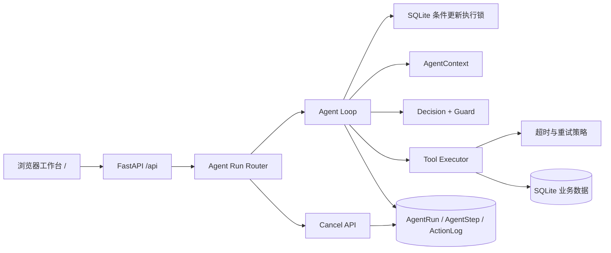

# 第六版 Agent Runtime 契约与架构

更新时间：2026-07-15

本文档是 Batch F 后 Agent Runtime 的最终接口、工具执行与可靠性说明。它不记录 Provider Key，也不把 mock fallback 表述为真实模型成功。

## 架构



同一 `run_id` 通过条件更新从可执行状态原子进入 `running`。竞争请求不会创建第二个 executor，而是读取当前 Run 快照。取消会写入既有 `status` 字段的 `cancelled`，不新增数据库字段。

## Run API

| 方法 | 路径 | 行为 |
|---|---|---|
| `POST` | `/api/agent/runs` | 创建带 `objective`、`decisionMode`、`maxSteps` 的 Run。 |
| `GET` | `/api/agent/runs` | 返回当前用户范围内的 Run 摘要。 |
| `GET` | `/api/agent/runs/{run_id}` | 返回完整 snapshot 与 AgentStep 时间线。 |
| `POST` | `/api/agent/runs/{run_id}/execute` | 条件获取 executor 后推进或恢复同一 Run。并发调用不会重复执行。 |
| `POST` | `/api/agent/runs/{run_id}/cancel` | 幂等取消非终态 Run，返回最新 Run。 |
| `PATCH` | `/api/agent/runs/{run_id}` | 保留旧状态更新兼容；已取消 Run 不会被该接口重新打开。 |

Run 状态：`decided`、`running`、`waiting_confirmation`、`completed`、`failed`、`max_steps`、`cancelled`、`closed`。其中 `cancelled` 与 `closed` 都是终态；新代码使用 `cancelled`，`closed` 仅保留兼容。

取消是协作式的：Loop 会在决策前、入库前和工具返回后检查状态。已开始的 Python 同步工具不能被安全地强杀，因此取消不会回滚一个已经提交的原子正式写入；后续步骤会停止，且正式写入仍由确认、事务和幂等规则保护。

## Tool Contract 与超时策略

每个动作必须先经过 Tool Registry、schema、owner/goal scope 和 Decision Guard。Executor 会重复校验，不能只信任模型输出。

| 工具 | 数据性质 | 超时后策略 |
|---|---|---|
| `search_materials` | 只读检索 | 最多重试一次；第二次超时使 Run 以 `tool_timeout_read_retry_exhausted` 失败。 |
| `answer_only` | 只读终态建议 | 最多重试一次。 |
| `review_material` | 写 chunks / summary | 不自动重试。 |
| `answer_with_sources` | 写 QA record | 不自动重试。 |
| `create_review_draft` / `create_task_draft` | 写幂等草稿 | 不自动重试。 |
| `apply_confirmed_draft` | 高风险正式写入 | 不自动重试；使用确认、SQLite 事务、ActionLog 和 `appliedEntityIds` 查询恢复。 |
| `suggest_material_gap` | 生成受控建议 | 不自动重试。 |

`AGENT_TOOL_TIMEOUT_SECONDS` 控制工具 deadline，默认 `20` 秒。写工具 timeout 不做盲目重复调用；后续显式恢复必须首先依赖既有 idempotency key、Draft status 和 `appliedEntityIds` 判断结果。

## 正式写入与恢复

`apply_confirmed_draft` 仍在单一 SQLite 事务内完成：验证 accepted ActionLog 和 confirmed Draft -> 写入 tasks/flashcards -> 保存 `appliedEntityIds` -> 标记 Draft/ActionLog 为 applied。任一步异常回滚；已 applied 的请求会返回原实体 ID，不生成重复正式记录。

确认恢复后，Run 必须先完成 Context/Decision readback，再考虑剩余预算。这一行为由 Batch B6 保证，Batch F 没有改变其 snapshot 语义。

## 日志与隐私

持久化前，AgentRun snapshot、AgentStep context/decision/action/input/output/error 和 ActionLog observation/decision/payload 都会递归脱敏：

```text
apiKey / api_key / Authorization / Bearer token / token / password / secret
-> [redacted]
```

终态 Reflection 复用相同脱敏逻辑。业务资料和正式学习数据遵守已有用户与目标范围过滤；截图、评测报告和演示录屏不包含真实 Key、Authorization 或个人账号密码。

## 可复现交付

```bash
python -m pip install -r backend/requirements.txt
python -m uvicorn backend.app.main:app --host 127.0.0.1 --port 8001
```

第二条命令同时服务前端 `/`、API `/api`、健康检查 `/api/health` 和 OpenAPI `/docs`。固定版本见 `backend/requirements.lock`；CI 运行 pytest、compileall、smoke、前端语法检查和 `git diff --check`。

稳定端到端录屏：[batch-f-end-to-end.webm](../videos/batch-f-end-to-end.webm)。
