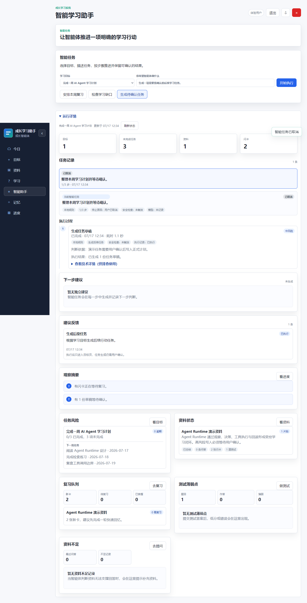
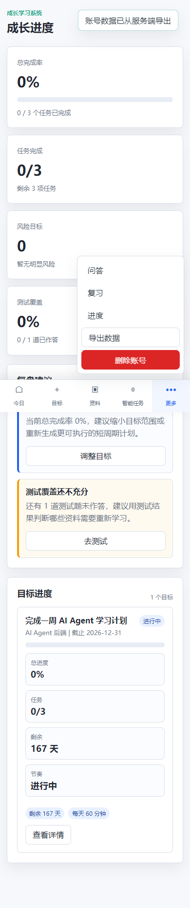

# 第七版 Batch 2 验收记录

验收日期：2026-07-17

分支：`feature/v7-ux-runtime`

范围：仅完成第七版 Batch 2 的 `UX-01` 至 `UX-06`、`RUN-01` 至 `RUN-03`、`PERF-01` 至 `PERF-02` 和 `DATA-01`；没有实施 Batch 3。

## 实现结果

- 新增 `GET /api/dashboard?date=...`，登录首屏只获取今日摘要、主线目标和最多 10 项今日任务。
- 将资料关联详情、闪卡、测试、Agent Context/历史移到进入相应视图后加载；新用户首屏不再产生每份资料的六类请求。
- 新增 `POST /api/agent/runs/{run_id}/advance`。它每次最多推进一个持久化 Step；确认或拒绝已有等待步骤也只处理该步骤。原 `/execute` 未修改批处理语义。
- 智能任务改为逐步推进；默认区域只保留目标、任务描述、快捷预设和开始按钮。运行历史、最大步数、Guard、Step、Tool I/O、JSON 和诊断信息进入默认关闭的“运行详情”。
- 移动端新增今日、目标、资料、智能任务、更多五项固定底部导航；更多菜单包含问答、复习、进度、导出数据和删除账号。桌面端继续使用侧边栏。
- 新用户首屏改为明确的目标、资料和智能任务入口，不再显示空指标墙。
- 将 localStorage 导出/清空替换为 `GET /api/auth/export` 和 `DELETE /api/auth/account`。导出排除密码哈希和会话令牌；删除需服务端 `DELETE` 确认，事务中清理账户所属学习数据与会话。
- Demo 等待确认 Run 的动作快照补齐注册表元数据和输入，确认后可以通过 `advance` 创建任务草稿；拒绝和取消均维持安全终态。

## 自动化验证

在项目根目录，以 Mock Provider 运行：

```powershell
$env:LLM_PROVIDER="mock"
$env:EMBEDDING_PROVIDER="mock"
$env:LLM_ENV_FILE=".missing-v7-gate.env"
python -m pytest backend/tests -q --tb=short
```

结果：`123 passed, 3 skipped in 72.60s`。

新增专项覆盖：

- `advance` 每次仅处理一个持久化 Step，确认步骤不会同次创建后续 Step。
- `/execute` 仍能按既有批处理方式执行。
- Dashboard 只返回首屏摘要并保持用户范围隔离。
- 服务端导出不泄漏凭据；删除账户后会话和所属资料不可再访问。
- Demo Run 的确认、拒绝、取消和 `advance` 状态转换。

附加基础门禁：

```text
python -m compileall -q backend                 通过
python -m pip check                             通过
node --check app/api.js                         通过
node --check app/app.js                         通过
node --check app/modules/agent-workbench.js     通过
node --check app/modules/goals.js               通过
node --check app/modules/materials.js           通过
node --check app/modules/progress.js            通过
git diff --check                                通过
```

## 浏览器验收

使用本地 Edge 与 Playwright 在独立临时 SQLite 数据库、同源 `http://127.0.0.1:8015` 中执行 `tests/browser/v7-batch2.spec.cjs`。

结果：`1 passed (8.2s)`。

- 新注册账号显示三项开始入口，首屏只请求 Dashboard，不请求资料或 Agent Run 历史。
- 创建目标和资料后，智能任务可以逐步调用 `advance`；Demo Run 完成确认后可继续并取消。
- 在 `390px`、`768px`、`1440px` 逐个访问今日、目标、资料、智能任务、问答、复习和进度，页面与文档宽度均不超过视口。
- `390px` 可见固定底部导航和包含问答、复习、进度、导出、删除账号的更多菜单。
- 服务端导出产生 `ai-agent-account-data.json`；删除账号后回到认证页。
- 页面异常为 0；账户删除主动吊销 Cookie 后的受保护请求 `401` 作为预期安全行为处理。

证据：





## 风险与后续边界

- 浏览器验收通过本机 Edge 执行；仓库尚未锁定 Playwright npm 开发依赖，CI 接入属于 Batch 4 的 `CI-01`，本批不提前实施。
- 本地 `.venv` 缺少 `sqlalchemy` 和 `argon2`，门禁使用项目此前可用的系统 Python；这属于本地环境偏差，不影响已经通过的系统 Python 结果。
- `DELETE /api/auth/account` 是不可逆操作，前端二次确认与服务端 `DELETE` 确认均保留；导出应在删除前完成。
- 本批只完成 Batch 2，不开始 PDF/Markdown 摄取、上传安全或 RAG 改造等 Batch 3 范围。
