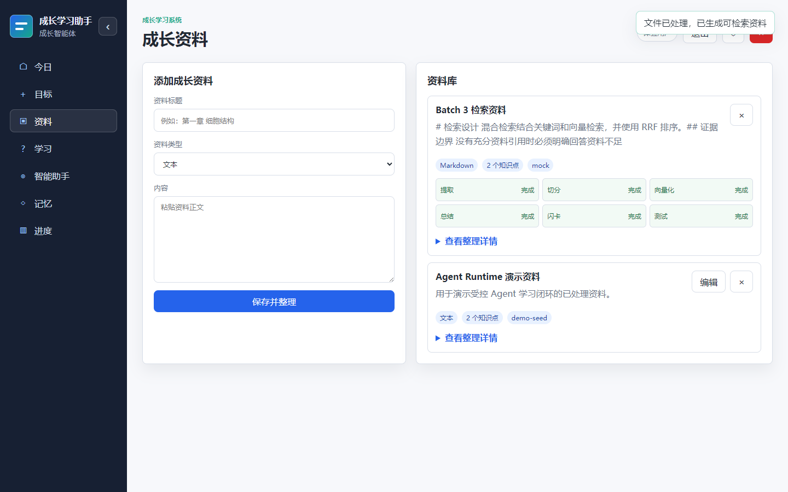
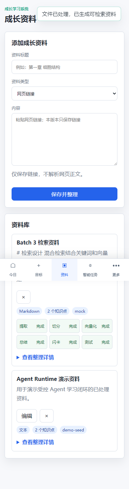

# 第七版 Batch 3 验收记录

验收日期：2026-07-17

分支：`feature/v7-ingestion-rag`

范围：仅完成第七版 Batch 3 的 `ING-01` 至 `ING-07` 和 `RAG-01` 至 `RAG-04`；没有实施 Batch 4。

## 实现结果

- 新增 `POST /api/materials/upload`，接受 PDF、Markdown 和 TXT；上传字节始终只在请求内存中解析，提取完成后仅保存文本、原文件名、MIME、页数和定位元数据，不写入原文件。
- 文件校验同时检查扩展名、MIME、PDF `%PDF-` 签名与文件名；拒绝超过 5 MB、超过 50 页、加密 PDF、压缩包、路径型文件名、MIME 不匹配和无可提取文本的扫描件，并返回“扫描件和 OCR 暂不支持”。
- PDF chunks 返回 `pageNumber`，Markdown chunks 返回 `headingPath` 和 `paragraphIndex`。资料页显示提取、切分、向量化、总结、闪卡和测试的状态；任一失败阶段可通过 `POST /api/materials/{id}/processing/{stage}/retry` 单独重试。
- `link` 资料不会调用切分、总结、闪卡或测试接口，前端和服务端都显示“仅保存链接，不解析网页正文”。资料文本在摘要、测试与问答提示中明确为不可信引用，模型不能把其中内容当系统指令或工具调用。
- 新增 Alembic `20260717_02_ingestion_rag_pgvector`：执行 `CREATE EXTENSION IF NOT EXISTS vector`，增加资料来源/状态/定位字段，保存 `embedding_vector vector(2048)`。Neon pgvector 的 `vector` HNSW 操作符类上限为 2000 维，因此实际索引为 `embedding_vector::halfvec(2048)` 上的 `halfvec_cosine_ops` HNSW；旧 JSON embedding 字段保留给 SQLite 和历史兼容。
- 真实 embedding Provider 固定请求 `embedding-3` / 2048 维；启动配置或 Provider 响应维度不符时失败。SQLite 的 Mock embedding 继续写 JSON，用于离线测试。
- 检索分别取 keyword、dense Top 20，以 RRF `k=60` 融合；dense 不可用则退回纯关键词。问答引用包含资料名、页码或标题/段落、原文、检索模式和分数。没有充分引用时由服务端直接返回 `grounded-refusal`，不调用模型编造资料依据。

## 自动化验证

在项目根目录执行：

```powershell
$env:LLM_PROVIDER="mock"
$env:EMBEDDING_PROVIDER="mock"
$env:LLM_ENV_FILE=".missing-v7-gate.env"
$env:EMBEDDING_ENV_FILE=".missing-v7-gate.env"
python -m pytest backend/tests -q --tb=short
```

结果：`136 passed, 3 skipped in 83.14s`。

新增 `test_batch3_ingestion_rag.py` 覆盖：

- Markdown 和带文本 PDF 的真实 multipart 上传、完整处理状态、PDF 页码、Markdown 标题层级与段落定位。
- 5 MB/50 页界限、PDF 签名、MIME、压缩包、路径文件名、加密 PDF 和扫描件/OCR 的拒绝路径。
- 总结阶段失败后单独重试，不重新上传原文件。
- Top 20 + RRF 的 hybrid 结果、embedding 失败的关键词降级、引用定位字段和资料不足硬拒答。
- `vector(2048)`、`halfvec(2048)` cosine HNSW、启动期 embedding 配置/维度契约及 Alembic head。

附加基础门禁：

```text
python -m compileall -q backend                 通过
python -m pip check                             通过
node --check app/api.js                         通过
node --check app/app.js                         通过
node --check app/modules/agent-workbench.js     通过
node --check app/modules/materials.js           通过
node --check app/modules/chat.js                通过
python -m alembic -c backend/alembic.ini history 通过，20260717_02 为 head
git diff --check                                通过
```

## 浏览器验收

本地 Edge + Playwright 使用显式同源 CORS 白名单、独立 SQLite 数据库和 `http://127.0.0.1:8018` 执行：

```powershell
$env:npm_config_cache=(Join-Path $PWD '.npm-cache')
$env:NODE_PATH=(Join-Path $PWD '.npm-cache\_npx\420ff84f11983ee5\node_modules')
npx.cmd @playwright/test test --config=tests/browser/playwright.v7-batch3.config.cjs
```

结果：`1 passed (4.6s)`。

- 一键试用后上传 Markdown，资料卡显示六个已完成阶段。
- 问答成功展示资料标题、`hybrid`、分数和引用；量子纠缠问题显示资料不足。
- 切换链接资料显示“仅保存链接，不解析网页正文”。
- 在 `390px` 下资料页和固定底部导航无文档级横向溢出；`pageerror=0`，非预期 console error 为 0。

证据：





## 外部 Neon 验收收口

- 安全加载已忽略的 `backend/.env` 后，确认 `DATABASE_URL` 为 pooled Neon URL、`MIGRATION_DATABASE_URL` 为同一隔离 endpoint 的 direct Neon URL；连接串、密码和 endpoint 标识均未输出、记录或提交。
- 迁移前 `python -m alembic -c backend/alembic.ini current` 实际返回 `20260716_01`。直连执行 `python -m alembic -c backend/alembic.ini upgrade head` 后，`current` 和 `alembic_version` 均为 `20260717_02`。
- 实际 SQL 确认 `vector` 扩展存在，`material_chunks.embedding_vector` 为 `vector(2048)`，`idx_material_chunks_embedding_vector_hnsw` 的访问方法为 `hnsw`、操作符类为 `halfvec_cosine_ops`。首次使用 `vector_cosine_ops` 的真实迁移被 Neon pgvector 拒绝，错误为 HNSW 不支持超过 2000 维；已在同一 Batch 3 迁移中修正为 `halfvec(2048)` expression index，并同步使 PostgreSQL dense 查询使用相同排序表达式。完整 source vector 仍为 2048 维，结果分数仍以该 source vector 的 cosine 距离计算。
- 使用同一隔离分支的 direct URL 临时设置 `POSTGRES_TEST_DATABASE_URL`，并显式设置 `LLM_PROVIDER=mock`、`EMBEDDING_PROVIDER=mock` 运行 PostgreSQL 集成测试。`test_postgres_batch3_pgvector_schema_has_2048_vector_and_cosine_hnsw_index`、会话/原子额度、认证限流/并发预留、资料批量写入四项均分项通过；新增 pgvector 测试还以 `EXPLAIN` 确认应用排序表达式可使用该 HNSW 索引。

## 风险与后续边界

- 本批的隔离 Neon 外部迁移、pgvector 扩展、2048 维 schema、cosine HNSW 和 PostgreSQL 集成测试均已实际验收；未连接、迁移或写入生产 Neon 分支。pgvector 对 `vector` HNSW 的 2000 维上限意味着本批必须持续使用已验收的 `halfvec(2048)` expression index；若未来改回 `vector_cosine_ops`，需先将 embedding 维度降至 2000 以下或取得平台支持后重新验收。
- 上传与处理目前同步执行，5 MB/50 页上限控制了请求时长；大文件异步队列、OCR、网页抓取和检索指标评测均属于后续范围，未提前进入 Batch 4。
- Playwright 运行器来自本机缓存，仓库尚未锁定其 npm 开发依赖；CI Playwright 接入仍属于 Batch 4 的 `CI-01`。
